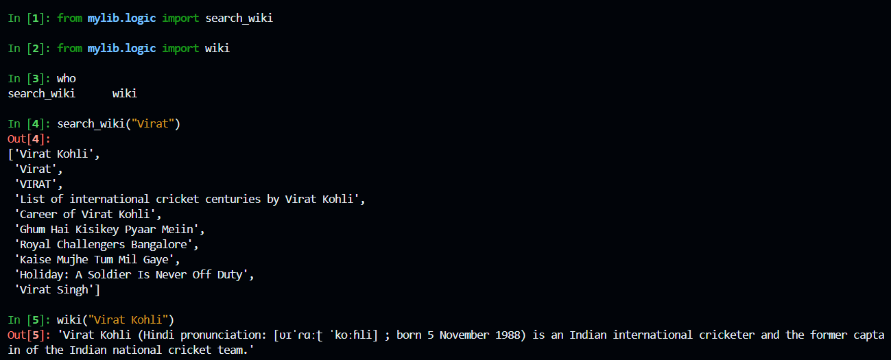

# NLP-WebApp

## Creating a virtual environment

1. Create virtual env `virtualenv ~/.venv`
2. Enter into bashrc to enable automatic activation of venv `vim ~/.bashrc`
3. Activation command `source ~/.venv/bin/activate`
4. To apply changes `source ~/.bashrc` or open a new terminal to see changes

## Creating empty files
1. Requirements.txt, Makefile, main.py Dockerfile using touch command [touch requirements.txt]
2. Populate Makefile [To add steps that are invovled in the project life cycle]
3. Populate requirements.txt with all the necessary tools
    3.1 To freeze the version with version number   `pip freeze | less `

## Makind directory
1. mkdir mylib
2. touch mylib/__init__.py [so that python can import it]
3. touch mylib/logic.py [creating a file inside]

## Git push
1. git status
2. git add *
3. git commit -m 'message'
4. Git pull
4. git push

## Setup github action for CI/CD
1. Go to repo and click action and add the .yaml file
2. Make changes in yml file as needed

## cli and test case
1. test.py  
2. cli-fire.py `touch cli-fire.py` insert the code then `chmod +x cli-fire.py` 
    2.1 `./cli-fire.py -- help`
    2.2 `./cli-fire.py`
    2.3 `./cli-fire.py --length 10`
    2.4 `./cli-fire.py --length 10 | less`
    2.5 `./cli-fire.py search_wiki "Virat Kohli"`

3. pip install Ipython >> `ipython` >> run jupyter notebook

# Note: 
1. When adding some new library to install, add it in the requirements.txt and run `make install` in the terminal
2. Run make commands when required
3. Git push after adding some new functionality

## Containerization
1. Dockerfile
2. Add build inside Makefile `docker build -t deploy-fastapi .` Then `make build`
3. `docker image ls` to see the list of all contianers
4. Add `docker run -p 127.0.0.1:8080:8080 b7b1a55db86f` in makefile and then `docker run` in the terminal

